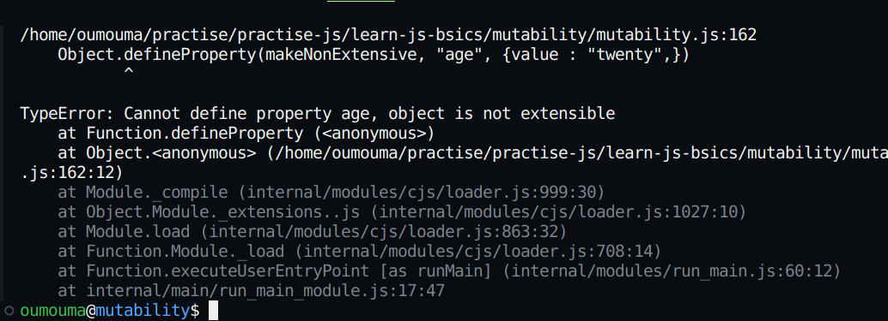
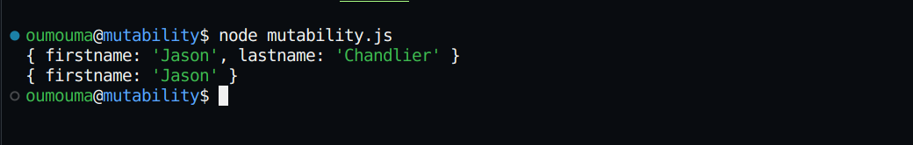

# Mutability in JavaScript

 1. `**Mutability**` refers to data types that can be accessed and changed after they've been created and stored in memory.

2. `**Immutabilty**`, on the other hand, refers to data types that you can,t change after creating them- but that you can still access in the memory

## What is the Stack?
+ Satck is a data structure that obeys the `Last In First Out` (LIFO) Principle. This implies that the last item to enter the `stack` goes out first.

## What is the Heap?
+  Reference data are stored inside the `heap`. When reference data is created, the variable of the data is placed on the `stack` but the actual value is placed on the `heap`.

## What are Primitive Data Tyes in JavaScript?
+ Primitive data types are immutable and are not objects because they lack properties and methods.Examples include : number, string, boolean, biginit, null, symbol, undefined
+ To determine the kind of data you are working with, use the `typeof` operator. The `typeof` operator works perfectly with all data types except `null`.

### Primitive Data Types Examples
+ Let's look ata some examples of primitive data types now to get a better understanding of what they are and how they work.

```JavaScript
let num = 23;
console.log(typeof num)
```
Here's an example of a string:
```JavaScript
let str = "Table"
```
Here's an example of an undefinded variable. A variable is said to be undefined if there are no values attached to it.
```JavaScript
let figure;
`nul`
let fig = null
console.log(fig)
console.log(fig === null)
```
Keep in mind that `null` is not the same as `NULL` or `Null`.

Here's an example of a boolean. This primitive data type is either `true` or `false`.
```JavaScript
let student = true;
let married = false;
```
Booleans are not strings - notice that `true` or `false` are not in quotes.

Here's an example of a sumbol. As a primitive data type, symbols are unique. The values that are returned are also guaranteed to be unique.
```JavaScript
const mySymbol = Symbol();
console.log(typeof mySymbol) // Symbol
```
Here's an example of BigInit. Use `BigInt` when the values you are working on are too big for the number data types.
```JavaScript
const myBigInt = 12n;
console.log(typeof myBigInt) // BigInt
const check = BigInt(414242532)
console.log(typeof check)
```
## What are Reference Data Types in JavaScript?
By default, reference data types are mutable. Reference data types consist of `Functions`, `Arrays`, and `Objects`.
Let's look  ata some examples of refrence data types to help in better understanding.

Here's an example of a function:
```JavaScript
function favorite(question) {
    console.log(`Hi dear, do you like ${question} programming language?`)
}

favorite(`JavaScript`)
```
An example of an array:
```JavaScript
const countriesVisited = ['Nigera','Japan', 'Australis']
console.log(countriesVisited)
```
An Example of an Object:
```
const touristData = {
    firstname: 'camila'
    lastname: 'Pedro',
    Nationality: 'Spanish',
}
console.log(touristData)
```
Just for clarity, the firstname is called the `key` while Camila is the `value`.

Reference data types place the variable on the `stack`.
The variable serves as a pointer that points to the `object` located on the `heap`.

The main distinction between these categories is that Primities are `immutable` but References are `mutable`.

# What is Mutability in JavaScript?
If a data type is mutable, that means that you can change it. Mutability allows you to modify existing values without creating new ones.

For every `Object`, a pointer is a added to the `stack`, and this pointer points to the `object` on the `heap`.

Take, for example, the following code:
```JavaScript
const staff = {
    name: "Strengthened",
    age: 43,
    Hobbies: ["reading", "Swimming"]
}
```
On the stack you will find `staff` which is a pointer to the actual aboject on the `heap`.

```JavaScript
const staff2 = staff;

console.log(staff);

console.log(staff2);
```

Another pointer is placed on the `stack` when `staff` was assigned 
Changing the to `staff2`. Now, these pointers point to a single object on the `heap`.

Reference data does not copy values, but rather pointers.
```JavaScript
staff2.age = 53;

console.log(staff)

console.log(staff2)
```

Changing the `age` of `staff2` updates the `age` of the `staff` object. Now you know it is because both point to the same object.

# How to Clone Object Properties
You can clone the properties of an object using the `Object.assign()` method and the `spread` operator. With these, you can change the properties of the cloned object without changing the properties of the object from which it is cloned.

## How the `Object.assign()` method Works
The `Object.assign` method copies properties from an object(the source) into another object (the target) and returns the modified target object.

Here's the syntax:
`Object.assign(target, source)`

The method has two arguments, `target` and `source`. The `target` is the object that receives new properties, while the `source` is where the properties come from. The `target` can be an empty object `{}`.

In a situation where the `source` and `target` share the same `key`, the `source` object overwrites the value of the `key` on the target.

```JavaScript
const staff = {
    name: "Strengthened",
    age: 43,
    Hobies: ["reading", "Swimming"]
}

const staff2 = Object.assign({}, staff);
```

The properties of the `staff` object were cloned into an empty `target`.

`staff2` now has its own properties. You can prove this by changing the value of any of its properties. Making this change will not affect the values of the properties on the `staff` object.

```JavaScript
    staff2.age = 53;

    console.log(staff)

    console.log(staff2)
```

The value of `staff2.age` that was changed to `53` does not in any way affect the value of `staff.age` because they both have their own properties.

## How the `Spread` Operator Works
Here's the syntax of the spread operator:
```JavaScript
const newObj = {...obj}
```
Using the `Spread` operator is quite simple. You need to place three dots `...` before the name of the object whose properties you intend to clone:
```JavaScript
const staff = {
    name : "Strengthened",
    age: 43,
    Hobbies: ["reading","Swimming"]
}

const staff3 = {...staff};

staff2.age = 53;

console.log(staff)

console.log(staff2)
```
# What is Immutability in JavaScript
Immutability is the state where values are immmutable (that is, not able to be changed). A value is immutable when altering it is impossible. Primitive data types are immutbale, as we discussed above.

Let's llok at an example
```JavaScript
    const num = 4;
    const newNum = num;
```
Looking at the code above, `num` was reassigned to `newNum`. Now both `num` and `newNum` have a value of `64`.
Changine the value on `newNum` will not alter the value on `num`
```JavaScript
    let student1 = "Halina";

    let student2 = student1;
```
In the code above,  a variable called `student1` was created and assigned to `student2`.
```JavaScript
    student = "Brookes"
    console.log(student1);

    console.log(student2);
```

Changing `student1` to `Brooks` does not change the initial value on `student2`. This proves that in primitive data types, actual values are copied, so both have their own. On the stack memory, `student1` and `student2` are distinct.

The stack obeys the `Last-In-First-Out` principle. The first item that enters the stack is the last item to go out and vice versa. Accessing items stored in the stack is easy.

## How to prevent Object Mutability
So far you have learned that objects are mutable by default.
```JavaScript

const studentNames = {
    student1: 'Halina',
    student: "Brookes",
    student3: "Anthony"
}

Object.defineProperty(studentNames, "student4",{
    value: "Mirabel",
})

console.log(studentNames);
```
Now we've added `student4`.

To prevent object `mutability`, you can use the `Object.preventExtensions()`,`Object.seal()`, and `Object.freeze()` methods.

For all three methods, we will expolore adding properties using dot notation and the `define` property, modifying properties using defineProperty, and deleting properties.

This will give you a better understanding of the capabilities and limitations of each method, and ultimately help you in determining which method may be best suited for a particular use case.

So, let's dive in and explore these methods in moe detail.

## How to use the `Object.preventExtensions` Method

Here's the syntax of this method:

`Object.preventExtensions(obj)`

Using `Object.preventExtensions` stops new properties from entering the object. This object does not increase in size and maintains its properties. By default, all objects in JavaScript are extensible. With this method, you can delete properties from your object.

## How to add new properties
+ Using `dot notation`:
```JavaScript
const makeNonExtensive = {
    firstname: "Charles",
    lastname: "Chandlier"
}

Object.preventExtensions(makeNonExtenive)

makeNonExtensive.designation = "Software Engineer";

console.log(makeNonExtensive)
```

Check the console - the `designation` property was not added and there's no error message.
```JavaScript
    const obj = {
        firtname: "Derek",
        designation: "Software Engineer"
    }
```
+ Using the `defineProperty` method

Here's the syntax:
```JavaScript
Object.defineProperty(obj, prop, descriptor)
```
Here's what's going on in that code:
+ `obj`: The object you want to add properties to.
+ `prop`: You define the name of the property you want to add or change. It should be either a string or symbol
+ `Descriptor`: You include the value of the property.

```JavaScript
const makeNonExtensive = {
    firstname: "Charles",
    lastname:  "Chandlier"
}

Object.preventExtensions(makeNonExtensive)

Object.defineProperty(makeNonExtensive, "age", {value: "twenty",})

console.log(makeNonExtensive)
```

+ Adding new properties using the define property throws this error message: 

``` 
mutability.js:162
    Object.defineProperty(makeNonExtensive, "age", {value : "twenty",})
           ^

TypeError: Cannot define property age, object is not extensible
```



## How to modify and existing propety using the define `difine Property'
```JavaScript
const makeNonExtensive = {
    firstname: "Charles",
    lastname: "Chandlier"
}

Object.preventExtenstions(makeNonExtensive)

Object.defineProperty(makeNonExtensive, 'firstname', {
    value: 'Jason',
})
console.log(makeNonExtensive)
```

The value of property os a non-extensible object can be changed as demonstrated with the above line of code.


## How to delete a property

Here's the syntax
```JavaScript
delete object.propertyname
```

```JavaScript
const makeNonExtensive = {
    firstname: "Charlie",
    lastname: "Chandlier"
}

Object.prevenntExtentions(makeNonExtensive)

delete makeNonExtesive.lastname

console.log(makeNonExtensive)
```

